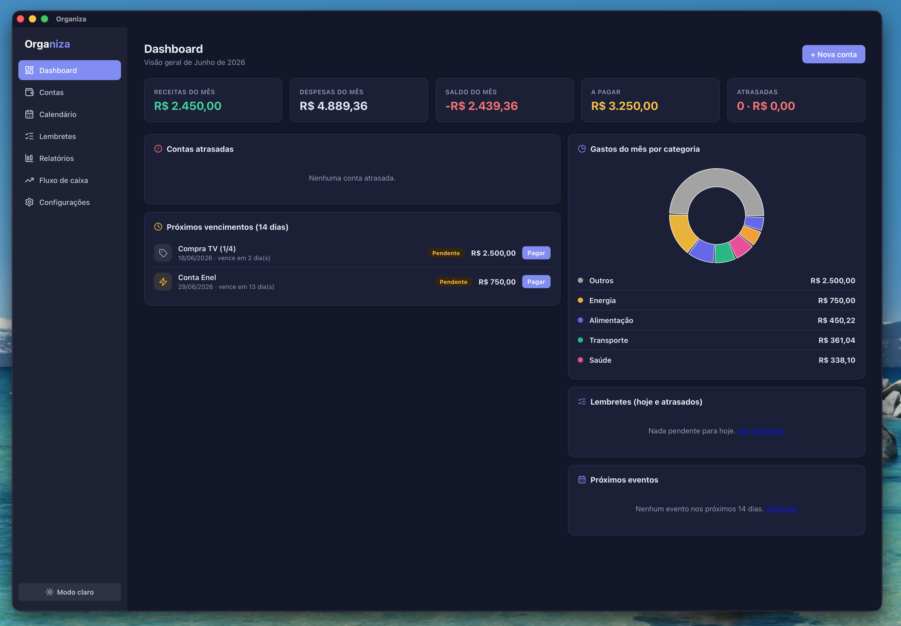
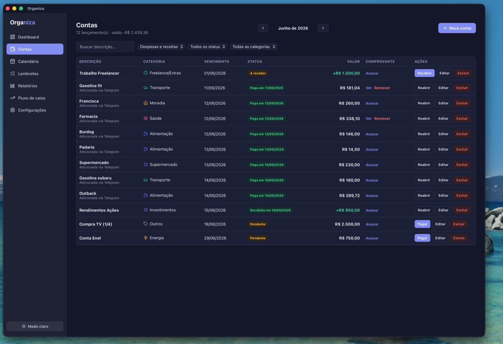
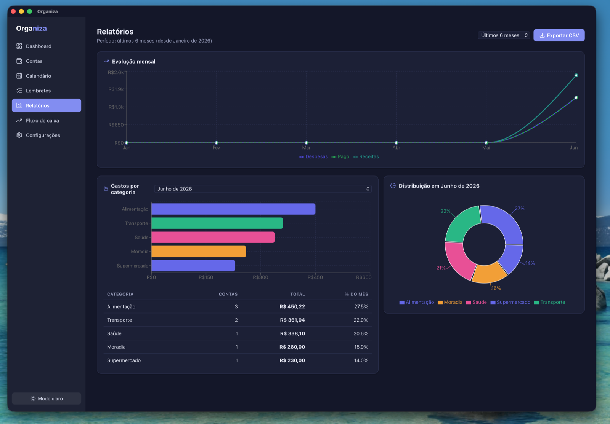
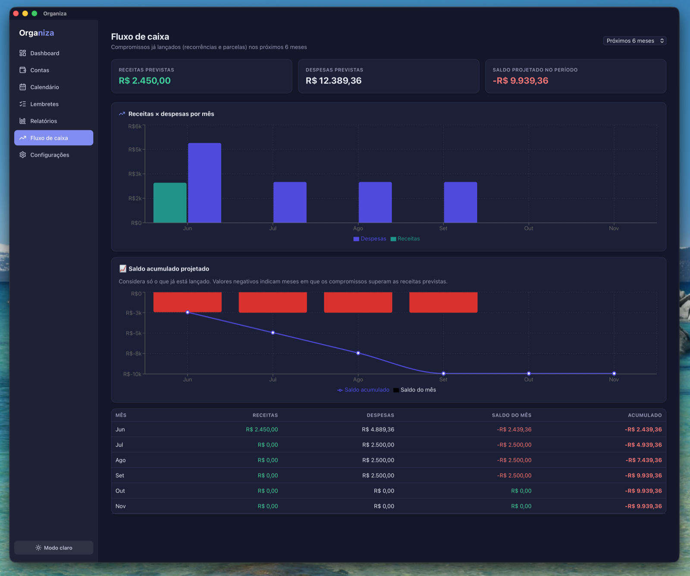
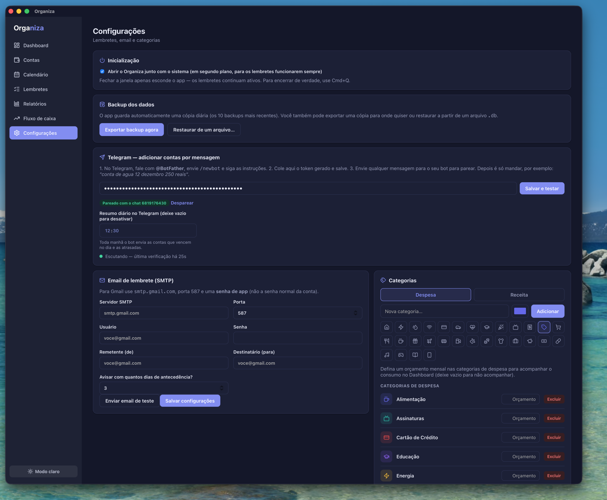

<div align="center">


# Organiza

**A local-first desktop app to manage bills, income, reminders and your calendar — with a Telegram bot to add entries from your phone.**

🇧🇷 [Leia em Português](README.pt-BR.md)


</div>

> The interface is in **Brazilian Portuguese (pt-BR)**. This document describes the project in English; the app itself is localized for Brazilian users (currency in BRL, dates as dd/mm/yyyy).

<div align="center">

</div>

---

## ✨ Features

- **📊 Dashboard** — month overview: income, expenses, balance, what's due, overdue bills, spending-by-category chart, budget progress and reminders.
- **💸 Bills & income** — full CRUD with categories, **recurring** entries, **installments** (e.g. 12×), paid/received status, receipt attachments, and an income/expense toggle.
- **📅 Calendar** — monthly view mixing events, bill due dates and reminders.
- **🔔 Reminders (to-do list)** — tasks with optional date/time, **recurrence** (daily/weekly/monthly), completion checkbox, and system notifications when due.
- **👨‍👩‍👧‍👦 Family members** — create family members and assign bills, income and reminders to one person or the whole family, with filters across bills, reminders, reports and cash flow.
- **📈 Reports & cash flow** — monthly evolution, spending by category, CSV export, and a 6–12 month cash-flow forecast based on commitments already entered.
- **🎯 Per-category budgets** — set a monthly cap and track consumption on the dashboard.
- **🤖 Telegram bot** — add bills, income and reminders by text from your phone, in natural Portuguese:
  - `conta de água 12 dezembro 250 reais`
  - `recebi 5500 salário dia 5`
  - `lembrar de ligar pro médico amanhã às 9h`
  - Include a family member's name to assign the entry to them
  - Ask questions: `saldo`, `quanto gastei`, `quanto gastei em comida`, `próximos vencimentos`, `atrasadas`, `lembretes`
  - Inline buttons to set category, mark paid/done, or delete
  - Optional **daily morning digest** of what's due today + overdue
- **💾 Backup & restore** — automatic daily backups (keeps the last 10) plus manual export/import.
- **🌙 Dark mode**, **autostart** (launch hidden with the system), optional macOS keep-awake mode, and **email (SMTP) reminders**.
- **🔒 Local-first & private** — all data lives in a local SQLite database on your machine. No cloud, no account.

## 📸 Screenshots

| Bills & income | Reports |
|---|---|
|  |  |
| **Cash-flow forecast** | **Settings (Telegram, backup, budgets)** |
|  |  |

## 🛠️ Tech stack

| Layer | Tech |
|------|------|
| Shell | [Tauri 2](https://tauri.app) (Rust) |
| Frontend | React 19 + TypeScript + Vite |
| Database | SQLite via [`tauri-plugin-sql`](https://github.com/tauri-apps/plugins-workspace) |
| Charts | [Recharts](https://recharts.org) |
| Icons | [Lucide](https://lucide.dev) |
| Email | [lettre](https://lettre.rs) (SMTP, Rust) |
| Telegram | Bot API via `reqwest` (Rust command) |

## 🚀 Getting started

### Prerequisites

- [Node.js](https://nodejs.org) 18+
- [Rust](https://www.rust-lang.org/tools/install) (stable) + the [Tauri prerequisites](https://tauri.app/start/prerequisites/) for your OS

### Run in development

```bash
npm install
npm run tauri dev
```

### Build a distributable app

```bash
npm run tauri build
```

The installer is generated under `src-tauri/target/release/bundle/` (e.g. `.dmg` on macOS, `.msi`/`.exe` on Windows, `.deb`/`.AppImage` on Linux).

## 🤖 Setting up the Telegram bot

1. In Telegram, talk to **@BotFather**, send `/newbot` and follow the steps to get a **token**.
2. In the app: **Configurações → Telegram**, paste the token and save.
3. Send any message to your bot to pair it (only the first chat that messages the bot is authorized).
4. Start adding entries and asking questions. Send `/menu` to the bot for the full syntax.

> The bot polls Telegram while the app is running. On macOS, enable **Configurações → Inicialização → Manter o Mac acordado** to prevent idle sleep while Organiza is open; the display may still turn off, and a closed laptop lid/offline Mac still cannot receive messages. For true 24/7 delivery without an awake local machine, you'd need a cloud webhook — out of scope for this local-first app.

## 📁 Project structure

```
src/
  pages/        # Dashboard, Contas, Calendário, Lembretes, Relatórios, Fluxo de caixa, Configurações
  components/   # Modal and entry forms
  lib/          # db, parser, telegram, reminders, consultas, backup, format, types
src-tauri/
  src/lib.rs    # Rust commands (SQL migrations, email, Telegram HTTP, backup, attachments)
scripts/
  testar-parser.ts  # standalone tests for the pt-BR message parser
```

Run the parser tests with:

```bash
npx esbuild scripts/testar-parser.ts --bundle --format=esm | node --input-type=module
```

## 🗄️ Where is my data?

A single SQLite file in the OS app-data directory, e.g. on macOS:
`~/Library/Application Support/com.fabio.organiza/organiza.db`. It survives reinstalls, and automatic backups are kept in a `backups/` subfolder.

## 📄 License

[MIT](LICENSE) © Fabio

---

<div align="center">
Built with <a href="https://tauri.app">Tauri</a> · Made for personal finance, in Brazilian Portuguese.
</div>
